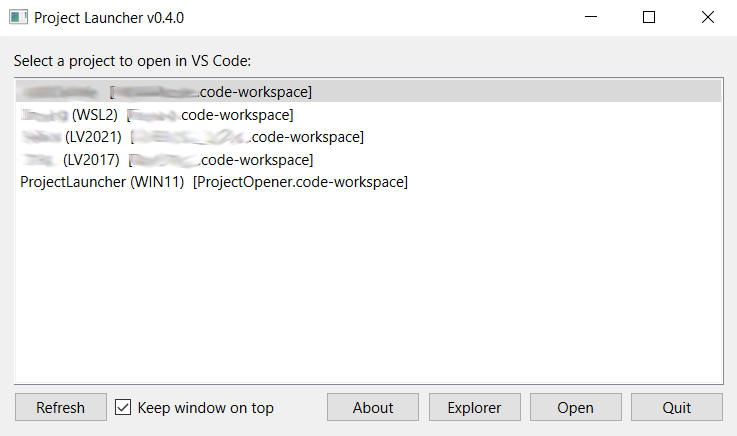

# ProjectOpener (C++ / Win32)

## Use Case & Pain Point

When working with multiple projects across different programming languages and environments, keeping track of all the directories becomes increasingly difficult. While you could document project locations somewhere, it is easy to lose track or forget where things are. ProjectOpener solves this by providing a simple, always-on-top window that lists your projects and lets you quickly open or switch workspaces in VS Code. This tool keeps your project list accessible and visible, so you never have to hunt for directories or remember paths. It streamlines your workflow by making workspace switching effortless and always available.



## Version

- Current version: `0.4.0`
- Release notes: see [CHANGELOG.md](CHANGELOG.md)

## What this does

- Shows a simple dialog-like window with a selectable project list.
- For each project folder, searches only that folder (non-recursive) for the first `.code-workspace` file.
- If found, opens that workspace in VS Code with `code --reuse-window`.
- If not found, opens the folder path directly in VS Code.
- Lets you open the selected project folder in File Explorer using the `Explorer` button or `Ctrl + double-click` on a list item.
- Includes an `About` dialog that shows the current version, build timestamp, key file paths, and quick-open actions.

## Example: Project List JSON

ProjectOpener uses a JSON file to define your project list. By default, this file should be named `projects.json` and placed in the working directory (the root folder where you launch ProjectOpener).

Each entry in the list should have a `name` (displayed in the UI) and a `path` (the directory to open). Example:

```json
[
  {
    "name": "Project_1 (STM32)",
    "path": "X:\\Projects\\CUSTOMER1\\PRODUCTNAME1\\"
  },
  {
    "name": "Project_2 (WSL2)",
    "path": "\\\\wsl$\\Ubuntu-22.04\\home\\username\\projects\\productname\\"
  },
  {
    "name": "Project_3 (Java)",
    "path": "X:\\Projects\\CUSTOMER2\\PRODUCTNAME2\\"
  },
  {
    "name": "Project_4 (LV2017)",
    "path": "X:\\Projects\\CUSTOMER3\\PRODUCTNAME3\\"
  },
  {
    "name": "ProjectLauncher (WIN11)",
    "path": "X:\\Projects\\Win\\ProjectOpener\\"
  }
]
```

- `name`: The label shown in the ProjectOpener window.
- `path`: The absolute or network path to the project directory.

## Development Environment Setup (VS Code)

This project builds through CMake, but the VS Code CMake Tools extension still needs a correctly configured toolchain environment.

### Prerequisites

- Visual Studio 2026 Community with MSVC x64 build tools
- Windows 10/11 SDK with `mt.exe` and `rc.exe`
- CMake (3.16+)
- Qt 6.10.2 for MSVC (`E:/Qt/6.10.2/msvc2022_64`)
- VS Code extensions:
  - CMake Tools
  - C/C++

### Workspace configuration

The workspace file [ProjectOpener.code-workspace](ProjectOpener.code-workspace) contains required CMake settings:

- Generator: `Visual Studio 18 2026`
- Build directory: `${workspaceFolder}/build`
- Qt prefix path: `E:/Qt/6.10.2/msvc2022_64/lib/cmake/Qt6`
- Windows SDK tools:
  - `CMAKE_MT=C:/Program Files (x86)/Windows Kits/10/bin/10.0.26100.0/x64/mt.exe`
  - `CMAKE_RC_COMPILER=C:/Program Files (x86)/Windows Kits/10/bin/10.0.26100.0/x64/rc.exe`

If your SDK version differs, update those two paths to the installed version on your machine.

### First-time configure steps

1. Open the repository by opening [ProjectOpener.code-workspace](ProjectOpener.code-workspace) in VS Code.
2. Run `CMake: Select a Kit` and choose MSVC x64 (Visual Studio 2026).
3. Run `CMake: Delete Cache and Reconfigure`.
4. Run `CMake: Build`.

### Rehearsal from clean state (recommended)

If you need to reproduce your setup from scratch (for example after installing Visual Studio or Qt), run this exact sequence from the repository root:

```powershell
if (Test-Path build-rehearsal) { Remove-Item -Recurse -Force build-rehearsal }
cmake -S . -B build-rehearsal -G "Visual Studio 18 2026" `
  -DCMAKE_PREFIX_PATH="E:/Qt/6.10.2/msvc2022_64/lib/cmake/Qt6" `
  -DCMAKE_MT="C:/Program Files (x86)/Windows Kits/10/bin/10.0.26100.0/x64/mt.exe" `
  -DCMAKE_RC_COMPILER="C:/Program Files (x86)/Windows Kits/10/bin/10.0.26100.0/x64/rc.exe"
cmake --build build-rehearsal --config Release
```

Run the app:

```powershell
.\build-rehearsal\Release\ProjectOpener.exe
```

This command path has been validated on this project and is the fastest fallback when VS Code CMake Tools kit detection is inconsistent.

### Troubleshooting

- If configure fails with missing `mt.exe`/`rc.exe`, verify Windows SDK install and update paths in [ProjectOpener.code-workspace](ProjectOpener.code-workspace).
- If Qt is not found, verify `CMAKE_PREFIX_PATH` points to your Qt6 package config folder.
- If settings do not seem to apply, reload the VS Code window and re-run `Delete Cache and Reconfigure`.

## Building

### Visual Studio 2026 Community

Visual Studio 2026 Community Edition is free for individual developers, students, and open-source projects.

From the workspace root:

```powershell
cmake -S . -B build -G "Visual Studio 18 2026"
cmake --build build --config Release
```

Run:

```powershell
.\build\Release\ProjectOpener.exe
```

The main window title shows the current application version so the running binary can be matched against the documented changelog entry. The `About` button opens a dialog with the same version, build timestamp, direct access to [CHANGELOG.md](CHANGELOG.md), and a button to open the workspace folder.

## Future development / learning ideas

- Add a status area showing whether each path exists.
- Add keyboard shortcuts (Enter to open, Esc to quit).
- Profile support — add an optional "profile" key to each JSON entry and pass --profile to the code command if it's present
- Last opened highlight — remember which project was opened last and visually mark it, useful when switching machines
- Tray icon instead of floating window — if the window starts feeling intrusive, a system tray icon with a right-click menu is the next natural evolution and keeps the desktop clean

## Implemented features / fixed issues

- Added the stay on top radio button along with the stay on top functionality
- Added the refresh button for loading updated json list - no need to restart the app
- Replace raw Win32 UI with a framework later (Qt, wxWidgets, WinUI) after understanding this baseline. - replaced Win32 API with Qt
- Solved the Qt topmost flickering replacing that part with Win32 API functionality

## Acknowledgements

This project uses the following third-party libraries:

- [Qt](https://www.qt.io/) — Copyright The Qt Company. Licensed under LGPL/GPL/commercial licenses.
- [nlohmann/json](https://github.com/nlohmann/json) — Copyright Niels Lohmann. Licensed under MIT License.

Please refer to their official documentation and license files for more information.
